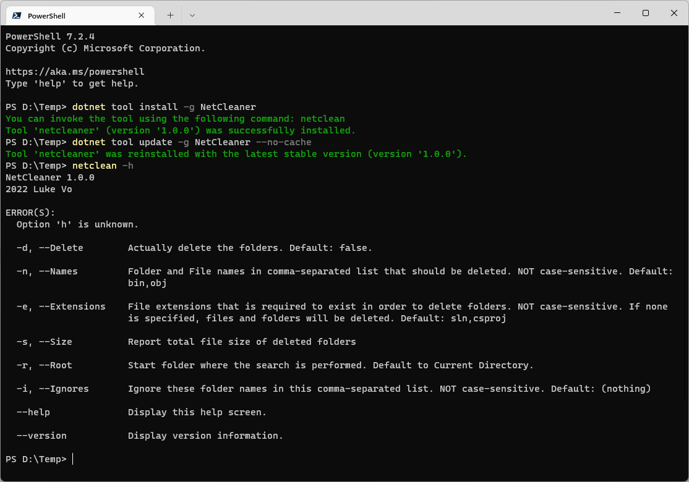
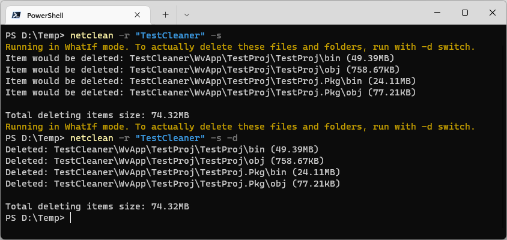

# NetCleaner

A simple CLI tool for cleaning up your .NET project folders. Quickly delete `bin` and `obj` folders with safety as files only get deleted when `.csproj` or `.sln` file presents in the folder.

# Installation

The tool requires .NET 6.0 or up. You can [download it here](https://dotnet.microsoft.com/en-us/download).

Install the CLI globally from [Nuget](https://www.nuget.org/packages/NetCleaner):

```ps
dotnet tool install -g NetCleaner
```

To make sure the tool is up-to-date, run this command:

```ps
dotnet tool update -g NetCleaner --no-cache
```

After that you can try running `netclean --help` or `netclean --version` to ensure the tool was installed.



# Usage

Run `netclean -h` to list all supported parameters.

By default, the tool runs in `WhatIf` mode and no file are actually deleted. When you are sure the files/folders are good to be deleted, run with `-d` or `--Delete`.

For example, `netclean -r "TestCleaner" -s` would search all `obj` and `bin` folders/files inside `TestCleaner` folder (relative to current directory) as well as report the size of these folders/files.

Running `netclean -r "TestCleaner" -s -d` would actually delete the folders/files.



```ps
-d, --Delete
Actually delete the folders. Default: false.

-n, --Names
Folder and File names in comma-separated list that should be deleted. NOT case-sensitive. Default: bin,obj

-e, --Extensions
File extensions that is required to exist in order to delete folders. NOT case-sensitive. If none is specified, files and folders will be deleted. Default: sln,csproj,wapproj

-s, --Size
Report total file size of deleted folders

-r, --Root
Start folder where the search is performed. Default to Current Directory.

-i, --Ignores
Ignore these folder names in this comma-separated list. NOT case-sensitive. Default: (nothing)

--help
Display this help screen.

--version
Display version information.
```
